# Primera tasca APA 2023: Anàlisi fitxer de so

## Nom i cognoms: Andreu Snijders i Adrián Fernández

## Representació temporal i freqüencial de senyals d'àudio

### Domini temporal

Per llegir, escriure i representar un fitxer en format `*.wav` en python podem fem servir els següents mòduls:

- Numpy:

    ```python
    import numpy as np
    ```

- Matplotlib:

    ```python
    import matplotlib.pyplot as plt
    ```

- Soundfile:

    ```python
    import soundfile as sf
    ```

Per **crear** i **guardar** a un fitxer un senyal sinusoidal de freqüència `fx Hz`, digitalitzat a `fm Hz`, de durada `T` segons i amplitud
`A` fem:

```python
T= 2.5                               # Durada de T segons
fm=8000                              # Freqüència de mostratge en Hz
fx=440                               # Freqüència de la sinusoide
A=4                                  # Amplitud de la sinusoide
pi=np.pi                             # Valor del número pi
L = int(fm * T)                      # Nombre de mostres del senyal digital
Tm=1/fm                              # Període de mostratge
t=Tm*np.arange(L)                    # Vector amb els valors de la variable temporal, de 0 a T
x = A * np.cos(2 * pi * fx * t)      # Senyal sinusoidal
sf.write('so_exemple1.wav', x, fm)   # Escriptura del senyal a un fitxer en format wav
```

El resultat és un fitxer guardat al directori de treball i que es pot reproduir amb qualsevol reproductor d'àudio

Per **representar** gràficament 5 períodes de senyal fem:

```python
Tx=1/fx                                   # Període del senyal
Ls=int(fm*5*Tx)                           # Nombre de mostres corresponents a 5 períodes de la sinusoide

plt.figure(0)                             # Nova figura
plt.plot(t[0:Ls], x[0:Ls])                # Representació del senyal en funció del temps
plt.xlabel('t en segons')                 # Etiqueta eix temporal
plt.title('5 periodes de la sinusoide')   # Títol del gràfic
plt.show()                                # Visualització de l'objecte gràfic. 
```

El resultat del gràfic és:


> Nota: Si es treballa amb ipython, es pot escriure %matplotlib i no cal posar el plt.show() per veure gràfics

El senyal es pot **escoltar (reproduir)** directament des de python important un entorn de treball amb els dispositius de so, com per
exemple `sounddevice`:

```python
import sounddevice as sd      # Importem el mòdul sounddevice per accedir a la tarja de so
sd.play(x, fm)                # Reproducció d'àudio
```

### Domini transformat

Domini transformat. Els senyals es poden analitzar en freqüència fent servir la Transformada Discreta de Fourier.

La funció que incorpora el paquet `numpy` al submòdul `fft` és `fft`:

```python
from numpy.fft import fft     # Importem la funció fft
N=5000                        # Dimensió de la transformada discreta
X=fft(x[0 : Ls], N)           # Càlcul de la transformada de 5 períodes de la sinusoide
```

I podem representar el mòdul i la fase, en funció de la posició de cada valor amb:

```python
k=np.arange(N)                        # Vector amb els valors 0≤  k<N

plt.figure(1)                         # Nova figura
plt.subplot(211)                      # Espai per representar el mòdul
plt.plot(k,abs(X))                    # Representació del mòdul de la transformada
plt.title(f'Transformada del senyal de Ls={Ls} mostres amb DFT de N={N}')   # Etiqueta del títol
plt.ylabel('|X[k]|')                  # Etiqueta de mòdul
plt.subplot(212)                      # Espai per representar la fase
plt.plot(k,np.unwrap(np.angle(X)))    # Representació de la fase de la transformad, desenroscada
plt.xlabel('Index k')                 # Etiqueta de l'eix d'abscisses 
plt.ylabel('$\phi_x[k]$')             # Etiqueta de la fase en Latex
plt.show()                            # Per mostrar els grafics
```


## Proves i exercicis a fer i entregar

1. Reprodueix l'exemple fent servir diferents freqüències per la sinusoide. Al menys considera $f_x = 4$ kHz, a banda d'una freqüència pròpia en el marge audible. Comenta els resultats.
<br>

**Aquest exercici l'hem resolt amb el codi** `AS_AF_code1.ipynb`.

<div align="center">
 
#### *Sinusoide de 1KHz*

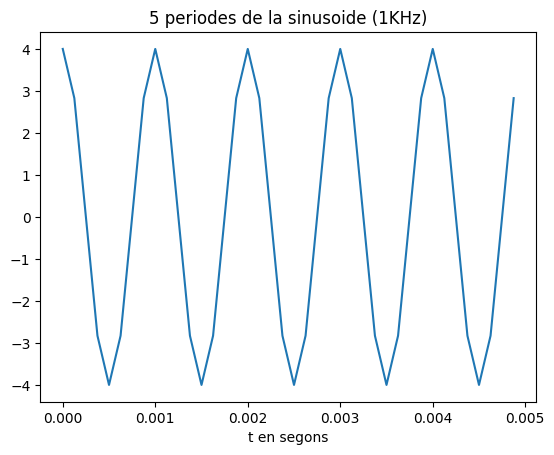
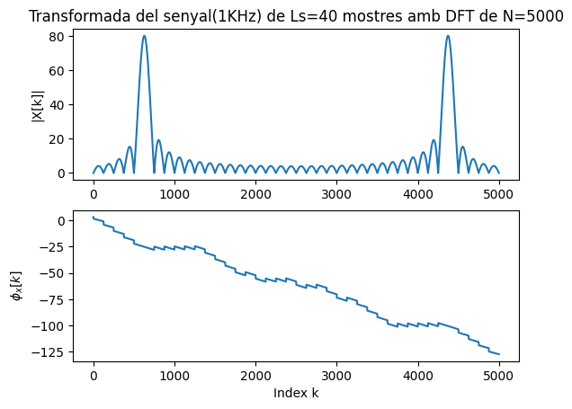

</div>

comentar que la sinus no es veu be perque el sample rate es massa baix, pitjor resolucio de la forma d'ona... Explicar el pic de la transformada

<br><div align="center">

#### *Sinusoide de 4KHz*

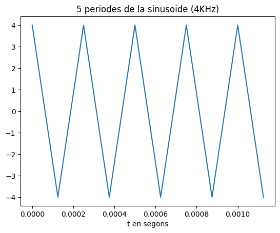
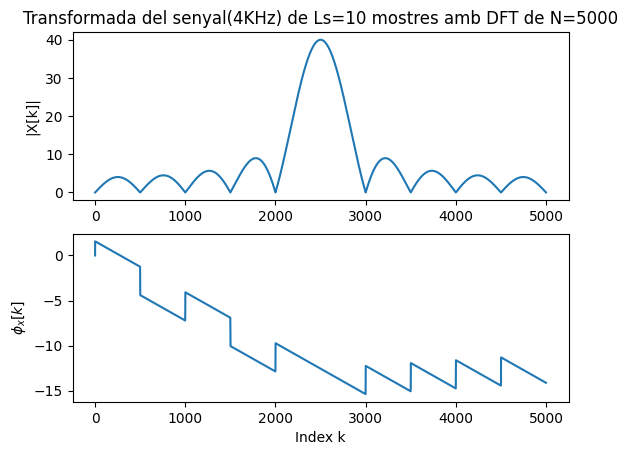
</div>
comentar que es veu encara pitjor, al limit del aliasing ja que es la meitat de la freq de mostreig, la frequnecia màxima que es pot representar sense aliasing... Explicar el pic de la transformada. Comparar i explicar com afecta el Ls(nombre de mostres) a la "precisió" de la transformada -> com més gran el nombre de mostres, mes gran es la ratio (lobul_pic / lobuls_secundaris)

<br><div align="center">

#### *Sinusoide de 5KHz*

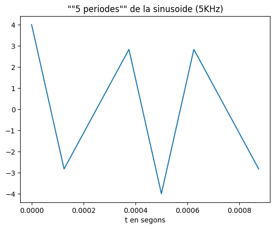
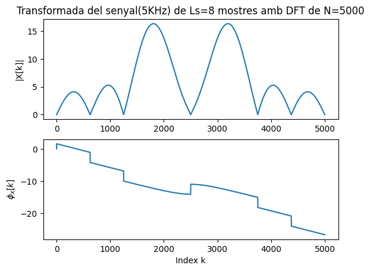
</div>
comentar que el senyal es distorsiona ja que es podrueix aliasing i explicar els pics que veiem en la transformada... Comparar i explicar com afecta el Ls(nombre de mostres) a la "precisió" de la transformada -> com més gran el nombre de mostres, mes gran es la ratio (lobul_pic / lobuls_secundaris)
<br><hr>

2. Modifica el programa per considerar com a senyal a analitzar el senyal del fitxer wav que has creat (`x_r, fm = sf.read('nom_fitxer.wav')`).

    - Insereix a continuació una gràfica que mostri 5 períodes del senyal i la seva transformada.

    - Explica el resultat del apartat anterior.

<br>

**Aquest exercici l'hem resolt amb el codi** `AS_AF_code2.ipynb`.

<div align="center">

#### *Sinusoide de 2KHz*
</div>

El so que hem analitzat és el `so_2KHz.wav` que hem generat amb el codi del exercici anterior. Primerament hem obtingut la seva freqüència fonamental, el qual és senzill ja que es tracta d'un sol sinus. Això ho hem fet realitzant la FFT del senyal i trobant la frequencia la qual tenia un valor més gran. Amb la freqüència fonamental hem pogut calcular el periode i generar les següents gràfiques 

<div align="center">

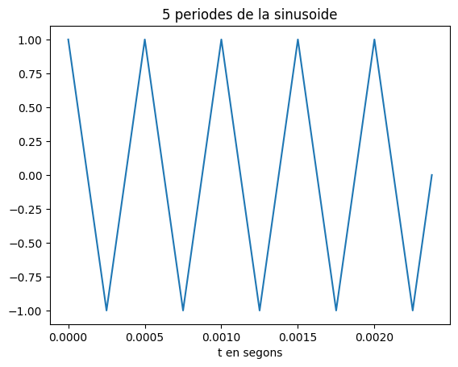
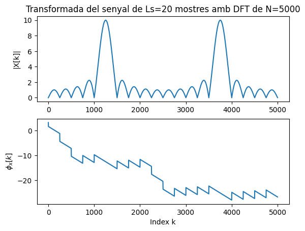
</div>
<hr>

3. Modifica el programa per representar el mòdul de la Transformada de Fourier en dB i l'eix d'abscisses en el marge de
    $0$ a $f_m/2$ en Hz.

    - Comprova que la mesura de freqüència es correspon amb la freqüència de la sinusoide que has fet servir.

    - Com pots identificar l'amplitud de la sinusoide a partir de la representació de la transformada?
      Comprova-ho amb el senyal generat.

    > NOTES:
    >
    > - Per representar en dB has de fer servir la fórmula següent:
    >
    > $X_{dB}(f) = 20\log_{10}\left(\frac{\left|X(f)\right|}{\max(\left|X(f)\right|}\right)$
    >
    > - La relació entre els valors de l'índex k i la freqüència en Hz és:
    >
    > $f_k = \frac{k}{N} f_m$

<br>

**Aquest exercici l'hem resolt amb el codi** `AS_AF_code3.ipynb`.

<div align="center">

#### *Sinusoide de 2KHz*
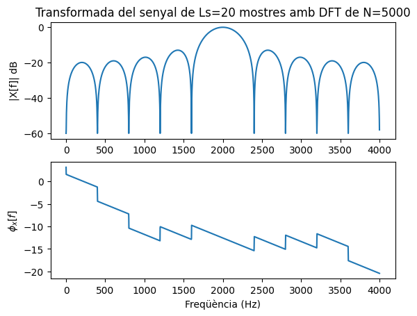
</div>

Per adaptar la gràfica a dBs en el rang freqüencial de $0$ a $f_m/2$ hem implementat les següents linies de codi entre altres: 

```python
epsilon = 1e-20                       
dBs = 20 * np.log10(abs(X_half+epsilon) / max(abs(X_half+epsilon)))
dB_min = -60
dBs = np.maximum(dBs, dB_min)
```
Hem afegit un valor de epsilon per evitar la operació $20 \log_{10} \left( \frac{0}{\max(|X(f)|)} \right)$ (per evitar la divisió de 0). 

A més hem hagut de reduir el rang de valors que poden prendre els coefficients en dBs a un mínim de $-60dB$ per una millor visualització de la gràfica (hi ha coefficients que s'aproximen al $-\infty$). 

Observant la gràfica de la transformada veiem que el pic arriba als $0dB$ que en escala lineal es correspon a 1. Com la referència a l'hora de passar a escala logarítmica és el valor màxim de la FFT i el pic és 1 sabem que la sinusoide té un amplitud normalitzada amb valor 1 (valor màxim que pot prendre).
<hr>

4. Tria un fitxer d'àudio en format wav i mono (el pots aconseguir si en tens amb altres formats amb el programa Audacity).
    Llegeix el fitxer d'àudio i comprova:

    - Freqüència de mostratge.
    - Nombre de mostres de senyal.
    - Tria un segment de senyal de 25ms i insereix una gráfica amb la seva evolució temporal.
    - Representa la seva transformada en dB en funció de la freqüència, en el marge $0\le f\le f_m/2$.
    - Quines son les freqüències més importants del segment triat?

<br>

**Aquest exercici l'hem resolt amb el codi** `AS_AF_code4.ipynb`.

Primer hem carregat l'arxiu `luzbel44.wav` i hem comprovat que l'arxiu és mono i hem consultat les seves característiques:

```python
x, fm = sf.read('luzbel44.wav')
if(x.ndim == 1):
    print("El archivo de audio es mono \U0001F412 \U0001F44D")
```

Output: `El archivo de audio es mono 🐒 👍`
<br>

```python
fm              # freqüència de mostratge
```
Output: `44100`
<br>

```python
L = len(x)
L               # nombre de mostres
```
Output: `95091`
<br>

Seguidament hem escollit un fragment del senyal i l'hem representat:

```python
Tm = 1 / fm
Ls = int(fm * 25e-3)                     
t = Tm * np.arange(L)                    

plt.figure(0)                             
plt.plot(t[2222:2222+Ls], x[2222:2222+Ls])              
plt.xlabel('t en segons')                 
plt.title('Luzbel pensava que la vida era jauja')   
plt.show() 
```
<div align="center">

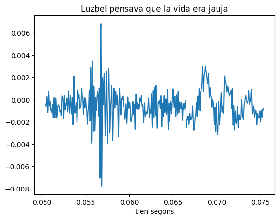
</div>
<br>
Finalment hem realitzat la transformada FFT d'aquest mateix fragment:

```python
N = 5000
X = fft(x[2222:2222+Ls], N)               
X_half = X[0:N//2]               
k = np.arange(N/2)                    
freq_axis = k * (fm / N)
epsilon = 1e-20                       
dBs = 20 * np.log10(abs(X_half+epsilon) / max(abs(X_half+epsilon)))
dB_min = -60
dBs = np.maximum(dBs, dB_min)

plt.figure(1)                         
plt.subplot(211)                      
plt.plot(freq_axis, dBs)              
plt.title(f'Transformada del senyal de Ls={Ls} mostres amb DFT de N={N}')   
plt.ylabel('|X[f]| dB')                  
plt.subplot(212)                      
plt.plot(freq_axis,np.unwrap(np.angle(X_half)))    
plt.xlabel('Freqüència (Hz)')                 
plt.ylabel('$\phi_x[f]$')             
plt.show()
```
<div align="center">

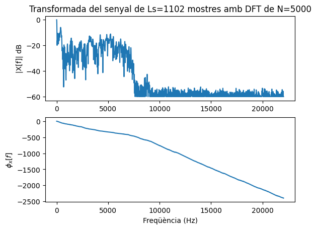
</div>
<br>

Aquests valors concorden amb el tipus d'audio que estem analitzant ja que es tracta d'un fragment de veu.

<hr>

## Entrega

- L'alumne ha de respondre a totes les qüestions formulades en aquest mateix fitxer, README.md.
  - El format del fitxer es l'anomenat *Markdown* que permet generar textos amb capacitats gràfiques (com ara *cursiva*, **negreta**,
  fòrmules matemàtiques, taules, etc.), sense perdre la llegibilitat en mode text.
  - Disposa d'una petita introducció a llenguatge de Markdown al fitxer `MARKDOWN.md`.
- El repositori GitHub ha d'incloure un fitxer amb tot el codi necesari per respondre les qüestions i dibuixar les gràfiques.
- El nom del fitxer o fitxers amb el codi ha de començar amb les inicials de l'alumne (per exemple, `fvp_codi.py`).
- Recordéu ficar el el vostre nom complet a l'inici del fitxer o fitxers amb el codi i d'emplar el camp `Nom i cognoms` a dalt de tot
  d'aquest fitxer, README.md.
