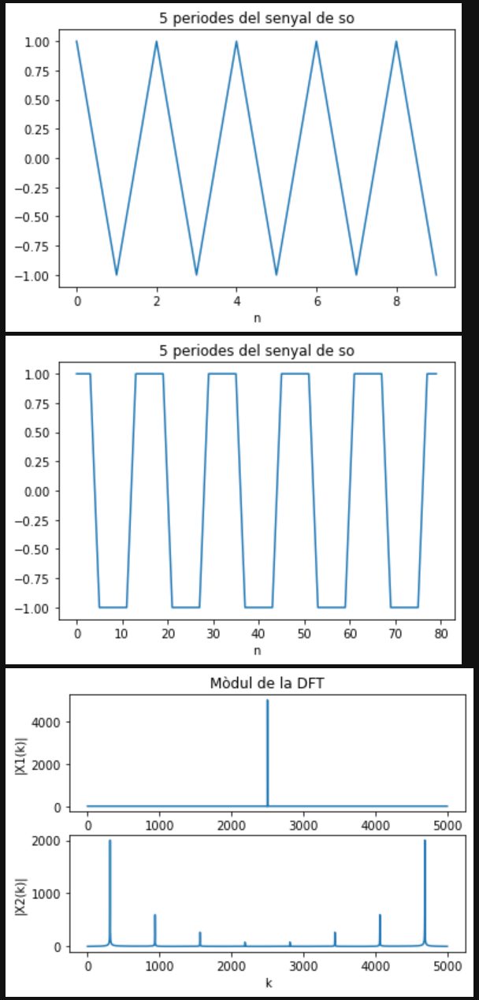
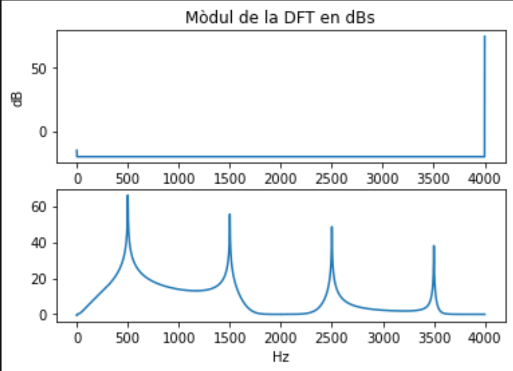
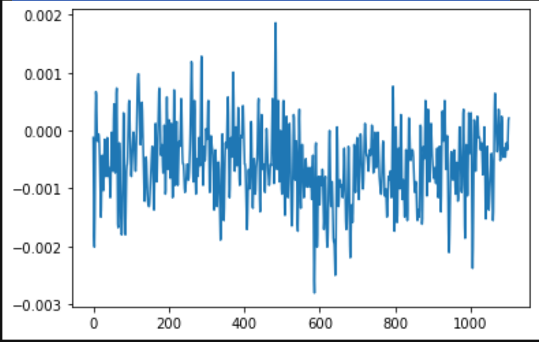
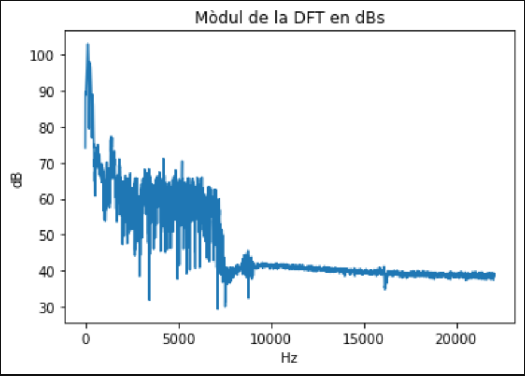

# Primera tasca APA 2023: Anàlisi fitxer de so

## Nom i cognoms: Gerard Cots i Joel Joan Morera

## Representació temporal i freqüencial de senyals d'àudio

### Domini temporal

Per llegir, escriure i representar un fitxer en format `*.wav` en python podem fem servir els següents mòduls:

- Numpy:

    ```python
    import numpy as np
    ```

- Matplotlib:

    ```python
    import matplotlib.pyplot as plt
    ```

- Soundfile:

    ```python
    import soundfile as sf
    ```

Per **crear** i **guardar** a un fitxer un senyal sinusoidal de freqüència `fx Hz`, digitalitzat a `fm Hz`, de durada `T` segons i amplitud
`A` fem:

```python
T= 2.5                               # Durada de T segons
fm=8000                              # Freqüència de mostratge en Hz
fx=440                               # Freqüència de la sinusoide
A=4                                  # Amplitud de la sinusoide
pi=np.pi                             # Valor del número pi
L = int(fm * T)                      # Nombre de mostres del senyal digital
Tm=1/fm                              # Període de mostratge
t=Tm*np.arange(L)                    # Vector amb els valors de la variable temporal, de 0 a T
x = A * np.cos(2 * pi * fx * t)      # Senyal sinusoidal
sf.write('so_exemple1.wav', x, fm)   # Escriptura del senyal a un fitxer en format wav
```

El resultat és un fitxer guardat al directori de treball i que es pot reproduir amb qualsevol reproductor d'àudio

Per **representar** gràficament 5 períodes de senyal fem:

```python
Tx=1/fx                                   # Període del senyal
Ls=int(fm*5*Tx)                           # Nombre de mostres corresponents a 5 períodes de la sinusoide

plt.figure(0)                             # Nova figura
plt.plot(t[0:Ls], x[0:Ls])                # Representació del senyal en funció del temps
plt.xlabel('t en segons')                 # Etiqueta eix temporal
plt.title('5 periodes de la sinusoide')   # Títol del gràfic
plt.show()                                # Visualització de l'objecte gràfic. 
```

El resultat del gràfic és:


> Nota: Si es treballa amb ipython, es pot escriure %matplotlib i no cal posar el plt.show() per veure gràfics

El senyal es pot **escoltar (reproduir)** directament des de python important un entorn de treball amb els dispositius de so, com per exemple `sounddevice`:

```python
import sounddevice as sd      # Importem el mòdul sounddevice per accedir a la tarja de so
sd.play(x, fm)                # Reproducció d'àudio
```

### Domini transformat

Domini transformat. Els senyals es poden analitzar en freqüència fent servir la Transformada Discreta de Fourier.

La funció que incorpora el paquet `numpy` al submòdul `fft` és `fft`:

```python
from numpy.fft import fft     # Importem la funció fft
N=5000                        # Dimensió de la transformada discreta
X=fft(x[0 : Ls], N)           # Càlcul de la transformada de 5 períodes de la sinusoide
```

I podem representar el mòdul i la fase, en funció de la posició de cada valor amb:

```python
k=np.arange(N)                        # Vector amb els valors 0≤  k<N

plt.figure(1)                         # Nova figura
plt.subplot(211)                      # Espai per representar el mòdul
plt.plot(k,abs(X))                    # Representació del mòdul de la transformada
plt.title(f'Transformada del senyal de Ls={Ls} mostres amb DFT de N={N}')   # Etiqueta del títol
plt.ylabel('|X[k]|')                  # Etiqueta de mòdul
plt.subplot(212)                      # Espai per representar la fase
plt.plot(k,np.unwrap(np.angle(X)))    # Representació de la fase de la transformad, desenroscada
plt.xlabel('Index k')                 # Etiqueta de l'eix d'abscisses 
plt.ylabel('$\phi_x[k]$')             # Etiqueta de la fase en Latex
plt.show()                            # Per mostrar els grafics
```


## Proves i exercicis a fer i entregar

1. Reprodueix l'exemple fent servir diferents freqüències per la sinusoide. Al menys considera $f_x = 4$ kHz, a banda d'una
    freqüència pròpia en el marge audible. Comenta els resultats.

    ```python
    import numpy as np                   # Importem la llibreria numpy
    import matplotlib.pyplot as plt      # Importem la llibreria matplotlib
    import soundfile as sf               # Importem la llibreria soundfile
    import sounddevice as sd             # Importem la llibreria sounddevice

    # Paràmetres del senyal sinusoidal i generació dels fitxers de so

    T= 2.5                               # Durada de T segons
    fm=8000                              # Freqüència de mostratge en Hz
    f1=4000                              # Freqüència de la sinusoide (4 kHz)
    f2=500                               # Freqüència de la sinusoide (10 kHz)
    A=4                                  # Amplitud de la sinusoide
    pi=np.pi                             # Valor del número pi
    L = int(fm * T)                      # Nombre de mostres del senyal digital
    Tm=1/fm                              # Període de mostratge
    t=Tm*np.arange(L)                    # Vector amb els valors de la variable temporal, de 0 a T
    x1 = A * np.cos(2 * pi * f1 * t)     # Senyal sinusoidal de freqüència f1
    x2 = A * np.cos(2 * pi * f2 * t)     # Senyal sinusoidal de freqüència f2
    sf.write('so_FREQ1.wav', x1, fm)     # Escriptura del senyal a un fitxer en format wav
    sf.write('so_FREQ2.wav', x2, fm)     # Escriptura del senyal a un fitxer en format wav

    # Representació dels senyals

    T1=1/f1                                   # Període del senyal
    T2=1/f2                                   # Període del senyal
    Ls1=int(fm*5*T1)                          # Nombre de mostres corresponents a 5 períodes de la sinusoide x1
    Ls2=int(fm*5*T2)                          # Nombre de mostres corresponents a 5 períodes de la sinusoide x2

    plt.figure(0)                             # Nova figura
    plt.plot(t[0:Ls1], x1[0:Ls1])             # Representació del senyal en funció del temps
    plt.xlabel('t en segons')                 # Etiqueta eix temporal
    plt.title('5 periodes de la sinusoide')   # Títol del gràfic
    plt.show()                                # Visualització de l'objecte gràfic.

    plt.figure(1)                             # Nova figura
    plt.plot(t[0:Ls2], x2[0:Ls2])             # Representació del senyal en funció del temps
    plt.xlabel('t en segons')                 # Etiqueta eix temporal
    plt.title('5 periodes de la sinusoide')   # Títol del gràfic
    plt.show()                                # Visualització de l'objecte gràfic.
    ```

    

    Podem observar que, al ser $f1 = 4 kHz$ (la freqüència límit per cumplir Nyquist **$f \leq \frac{fm}{2}$**), només mostregem les mostres justes per tal de poder representar el senyal sense que aparegui aliasing. Per altre banda la $f2 = 500 Hz$ es representa més fidelment al senyal original. Si volguéssim mostrejar senyals de més de $4 kHz$ hauríem de fer servir una freqüència de mostreig més gran. Com que aquests senyals s'hauran de reproduïr, podriem fer servir la freqüència de mostreig $fm=44100 Hz$ i així ens assegurem que es compleix Nyquist en tot l'ample de banda audible.

2. Modifica el programa per considerar com a senyal a analitzar el senyal del fitxer wav que has creat (`x_r, fm = sf.read('nom_fitxer.wav')`).

    ```py
    # Analisi de la senyal de so

    x1, fm = sf.read('so_FREQ1.wav')         # Lectura del senyal de so
    x2, fm = sf.read('so_FREQ2.wav')         # Lectura del senyal de so

    # Represntació de 5 períodes dels senyals de so

    plt.figure(2)                            # Nova figura
    plt.plot(x1[0:Ls1])                      # Representació del senyal en funció del temps
    plt.xlabel('n')                          # Etiqueta eix temporal
    plt.title('5 periodes del senyal de so') # Títol del gràfic
    plt.show()                               # Visualització de l'objecte gràfic.

    plt.figure(3)                            # Nova figura
    plt.plot(x2[0:Ls2])                      # Representació del senyal en funció del temps
    plt.xlabel('n')                          # Etiqueta eix temporal
    plt.title('5 periodes del senyal de so') # Títol del gràfic
    plt.show()                               # Visualització de l'objecte gràfic.

    # Transformat de Fourier dels senyals de so

    N = 5000                                 # Nombre de mostres de la DFT
    X1 = np.fft.fft(x1, N)                   # Càlcul de la DFT
    X2 = np.fft.fft(x2, N)                   # Càlcul de la DFT

    plt.figure(4)                            # Nova figura
    plt.subplot(2,1,1)                       # Subgràfic 1
    plt.plot(np.arange(N), np.abs(X1))       # Representació del mòdul de la DFT
    plt.title('Mòdul de la DFT')             # Títol del gràfic
    plt.ylabel('|X1(k)|')                    # Etiqueta eix de les ordenades
    plt.xlabel('k')                          # Etiqueta eix de les abcisses
    plt.subplot(2,1,2)                       # Subgràfic 2
    plt.plot(np.arange(N), abs(X2))          # Representació del mòdul de la DFT
    plt.ylabel('|X2(k)|')                    # Etiqueta eix de les ordenades
    plt.xlabel('k')                          # Etiqueta eix de les abcisses
    plt.show()                               # Visualització de l'objecte gràfic.
    ```

    - Insereix a continuació una gràfica que mostri 5 períodes del senyal i la seva transformada.
    
    
    
    - Explica el resultat del apartat anterior.

        Primer de tot podem observar que el senyal f2 mostrejat és diferent al senyal f2 original, això és degut a que alguna de les funcions (write o read) **ha normalitzat** els senyals entre -1 i 1, en el cas de f2, **saturant** tots els valors que es trobaven fora d'aquest rang. Això provoca que apareguin harmònics al espectre freqüencial de la $f2$. Pel que fa a l'espectre del senyal $f1$, aquest és molt ample perquè només hem tingut en compte només 5 períodes per a fer la FFT. Podem observar com hi apareix la freqüència correponent a 0.5 (si normalitzem l'espectre a 1), que correspon als $4 kHz$ ja que $fm = 8kHz$.

3. Modifica el programa per representar el mòdul de la Transformada de Fourier en dB i l'eix d'abscisses en el marge de
    $0$ a $f_m/2$ en Hz.

    - Comprova que la mesura de freqüència es correspon amb la freqüència de la sinusoide que has fet servir.

    - Com pots identificar l'amplitud de la sinusoide a partir de la representació de la transformada?
      Comprova-ho amb el senyal generat.

    > NOTES:
    >
    > - Per representar en dB has de fer servir la fórmula següent:
    >
    > $X_{dB}(f) = 20\log_{10}\left(\frac{\left|X(f)\right|}{\max(\left|X(f)\right|}\right)$
    >
    > - La relació entre els valors de l'índex k i la freqüència en Hz és:
    >
    > $f_k = \frac{k}{N} f_m$

    ```py
    # Representació en dBs i Hz

    freqs = ((np.arange(N)/N)*fm)
    eps = 0.1                                                                               # Constant per evitar el logaritme de zero
    dB1 = 20*np.log10(np.abs(X1) + eps)                                                     # Càlcul del mòdul en dBs
    dB2 = 20*np.log10(np.abs(X2))                                                           # Càlcul del mòdul en dBs

    plt.figure(5)                                                                           # Nova figura
    plt.subplot(211)                                                                        # Subgràfic 1
    plt.plot(freqs[0 : int(len(freqs)/2 + 1)], dB1[0 : int(len(dB1)/2 + 1)])                # Representació del mòdul de la DFT en dBs i fins a la meitat de la freqüència de mostreig
    plt.title('Mòdul de la DFT en dBs')                                                     # Títol del gràfic
    # plt.ylim(0, 40)                                                                       # Limitació de l'eix de les ordenades
    plt.ylabel('dB')                                                                        # Etiqueta eix de les ordenades
    plt.subplot(212)                                                                        # Subgràfic 2
    plt.plot(freqs[0 : int(len(freqs)/2)], dB2[0 : int(len(dB2)/2)])                        # Representació del mòdul de la DFT
    # plt.ylim(0, 40)                                                                       # Limitació de l'eix de les ordenades (per tal de millorar la visualització)
    plt.xlabel('Hz')                                                                        # Etiqueta eix de les abcisses
    plt.show()                                                                              # Visualització de l'objecte gràfic.
    ```
    
    

    En primer lloc podem veure que la relació senyal soroll mesurat logarítmicament (que és la manera de fer-ho més fidel a la percepció humana), no és tant bona com semblava linealment. Ara però ens és més fàcil veure les freqüències presents en Hz. El més interessant és el que observem a $f2$, ja que els harmònics que veiem són els imparells. 

    Per saber l'amplitud de la sinusoide a partir del mòdul de l'espectre hem de dividir el valor del mòdul pel nombre de mostres de la FFT i multiplicar per 2 en cas de que l'espectre es repeteixi (en el cas de $f = 4000 Hz$ no cal multiplicar-ho per 2). Si el mòdul està en dBs primer s'ha de passar a lineal i després fer el procediment anterior.

4. Tria un fitxer d'àudio en format wav i mono (el pots aconseguir si en tens amb altres formats amb el programa Audacity).
    Llegeix el fitxer d'àudio i comprova:
    
    ```python
    # Per tal de fer aquest exercici farem servir el fitxer de so "luzbel44.wav"

    import soundfile as sf                                      # Importem la llibreria soundfile
    import numpy as np                                          # Importem la llibreria numpy
    import matplotlib.pyplot as plt                             # Importem la llibreria matplotlib
    import sounddevice as sd                                    # Importem la llibreria sounddevice

    x, fm = sf.read('luzbel44.wav')                             # Lectura del senyal de so
    L = len(x)                                                  # Nombre de mostres del senyal de so
    Tm=1/fm                                                     # Període de mostratge

    print('La freqüència de mostreig és:', fm, 'Hz')            # Mostra de la freqüència de mostreig
    print('El període de mostreig és:', Tm, 's')                # Mostra del període de mostreig
    print('El nombre de mostres del senyal de so és:', L)       # Mostra del nombre de mostres del senyal de so
    print('La durada del senyal de so és:', L*Tm, 's')          # Mostra de la durada del senyal de so
    ```
    > Resultat:
    >
    > La freqüència de mostreig és: 44100 Hz
    >
    > El període de mostreig és: 2.2675736961451248e-05 s
    >
    > El nombre de mostres del senyal de so és: 95091
    >
    > La durada del senyal de so és: 2.1562585034013604 s

    - Freqüència de mostratge.
        
        La freqüència de mostreig és: 44100 Hz
    
    - Nombre de mostres de senyal.
    
        El nombre de mostres del senyal de so és: 95091
    
    - Tria un segment de senyal de 25ms i insereix una gráfica amb la seva evolució temporal.
        
        ```python
        # Sabent el nombre de mostres i el període de mostreig, podem calcular quantes mostres són 25 ms.

        T25ms = 25e-3                                                           # Durada de 25 ms
        N25ms = int(T25ms/Tm)                                                   # Nombre de mostres corresponents a 25 ms
        print('El nombre de mostres corresponents a 25 ms és:', N25ms)          # Mostra del nombre de mostres corresponents a 25 ms

        # Representació del senyal de so

        plt.figure(0)                                                           # Nova figura
        plt.plot(x[500 : 500 + N25ms])                                          # Representació del senyal en funció del temps
        plt.show()                                                              # Visualització de l'objecte gràfic.                   
        ```
        > Resultat:
        >
        > El nombre de mostres corresponents a 25 ms és: 1102
        

    - Representa la seva transformada en dB en funció de la freqüència, en el marge $0\le f\le f_m/2$.
        ```python
        # Representació de l'espectre de magnitud del senyal de so

        N = 5000                                                                # Nombre de mostres de la DFT
        X = np.fft.fft(10000*x, N)                                              # Càlcul de la DFT
        freqs = ((np.arange(N)/N)*fm)                                           # Càlcul del vector de freqüències
        dB = 20*np.log10(np.abs(X))                                             # Càlcul del mòdul en dBs

        plt.figure(1)                                                           # Nova figura
        plt.plot(freqs[0 : int(len(freqs)/2 + 1)], dB[0 : int(len(dB)/2 + 1)])  # Representació del mòdul de la DFT en dBs i fins a la meitat de la freqüència de mostreig
        plt.title('Mòdul de la DFT en dBs')                                     # Títol del gràfic
        plt.ylabel('dB')                                                        # Etiqueta eix de les ordenades
        plt.xlabel('Hz')                                                        # Etiqueta eix de les abcisses
        plt.show()                                                               # Visualització de l'objecte gràfic. 
        ```

        

    - Quines son les freqüències més importants del segment triat?

        Veient l'espectre podem observar que les components freqüencials més importants del tram escollit són les que van de 0 a uns 8000 Hz, això és degut a que es tracta d'un senyal de veu, el rang freqüencial es concentra a les freqüències més baixes.

## Entrega

- L'alumne ha de respondre a totes les qüestions formulades en aquest mateix fitxer, README.md.
  - El format del fitxer es l'anomenat *Markdown* que permet generar textos amb capacitats gràfiques (com ara *cursiva*, **negreta**,
  fòrmules matemàtiques, taules, etc.), sense perdre la llegibilitat en mode text.
  - Disposa d'una petita introducció a llenguatge de Markdown al fitxer `MARKDOWN.md`.
- El repositori GitHub ha d'incloure un fitxer amb tot el codi necesari per respondre les qüestions i dibuixar les gràfiques.
- El nom del fitxer o fitxers amb el codi ha de començar amb les inicials de l'alumne (per exemple, `fvp_codi.py`).
- Recordéu ficar el el vostre nom complet a l'inici del fitxer o fitxers amb el codi i d'emplar el camp `Nom i cognoms` a dalt de tot
  d'aquest fitxer, README.md.
